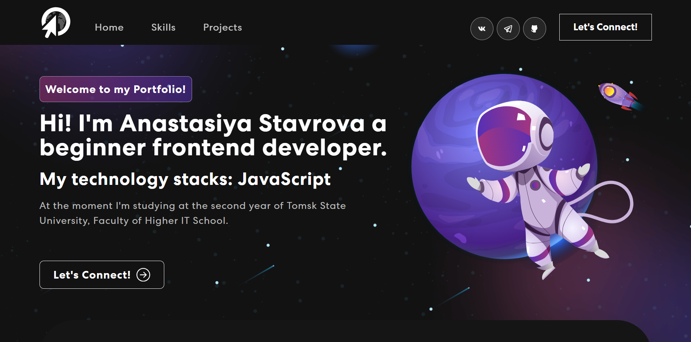
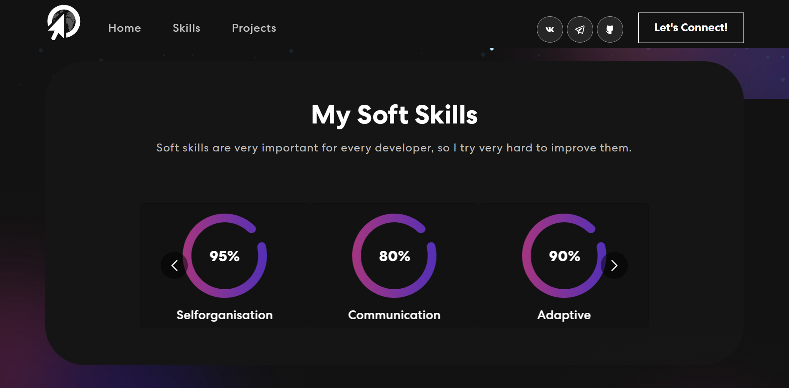
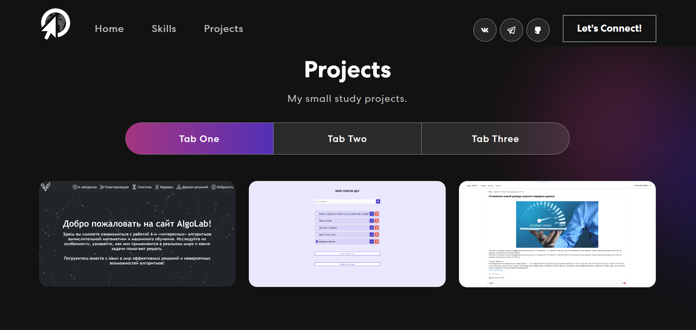
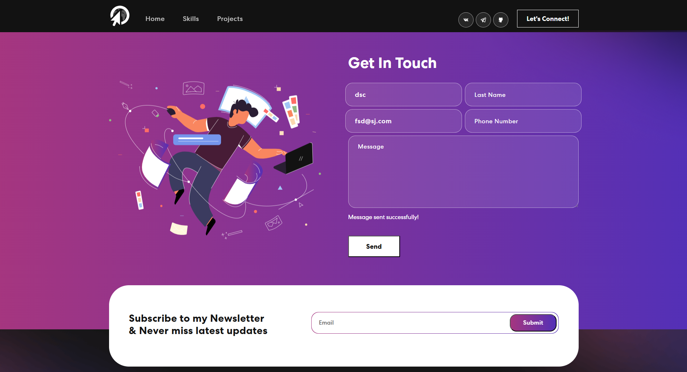

# Portfolio Website

A small project to create a portfolio website.

  
  
  
  

### :hammer_and_wrench: Technologies used in the project:

- react
- express
- dotenv
- cors
- nodemailer
- react-bootstrap
- react-bootstrap-icons
- react-multi-carousel
- mongoose

Resource [link](https://youtu.be/hYv6BM2fWd8?si=GqNyq2UoEkC-7q-T). 
Source code and resources are available at the link below the video.
